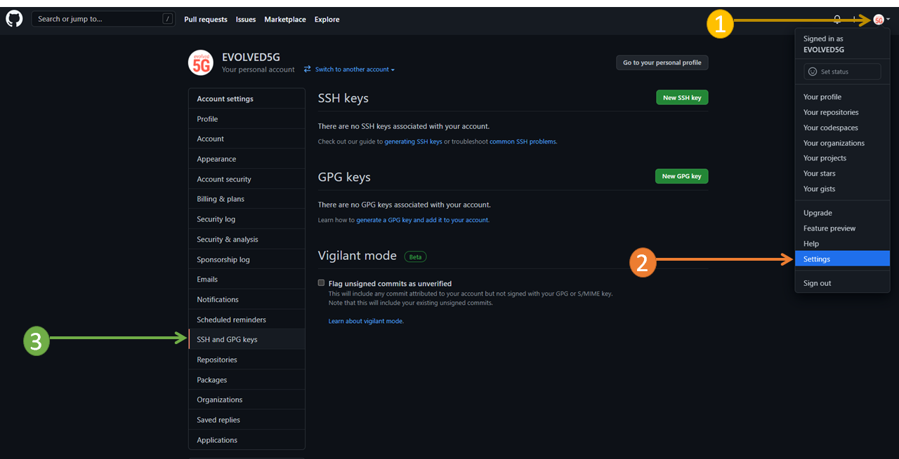
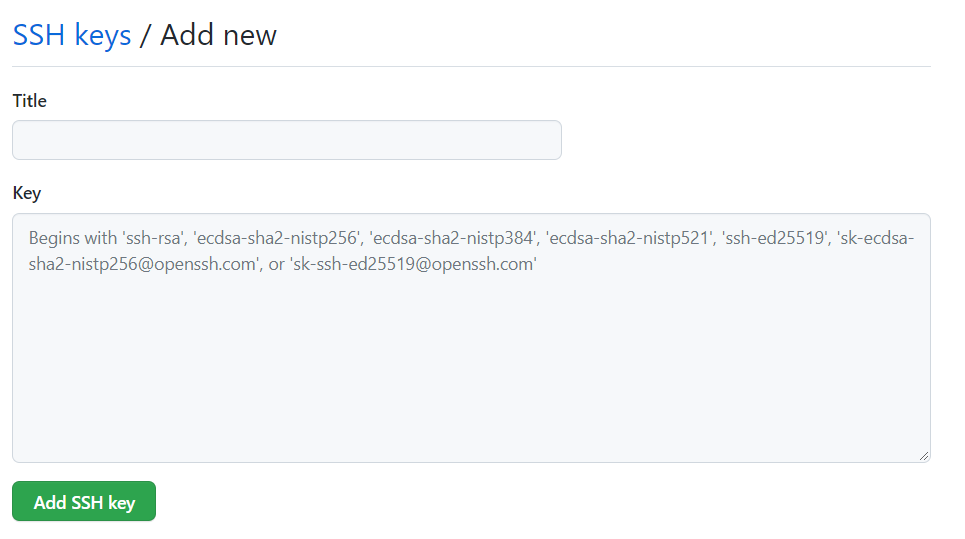
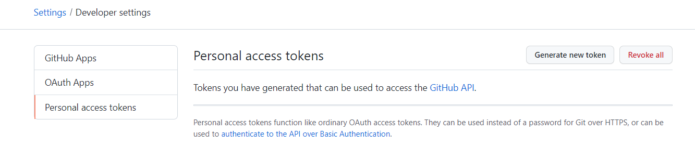
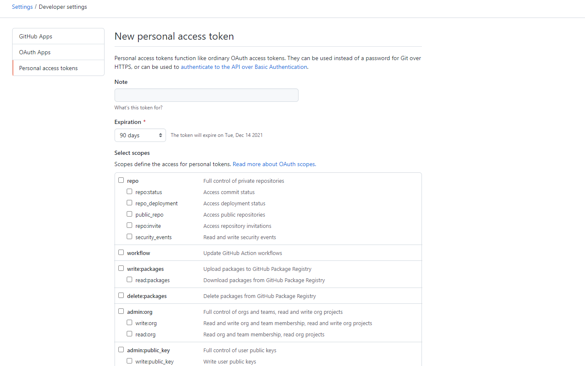
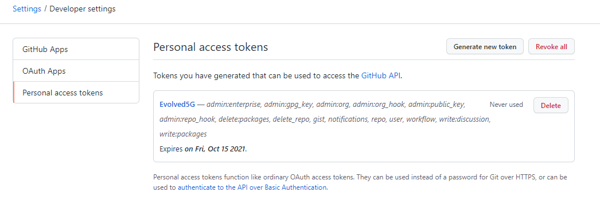

==============
Pre-requisites
==============

To create a new repository within the EVOLVED-5G organization it is mandatory to create an SSH key since the communication with the repository will be through SSH connection, to create the SSH key can be done as follows:

.. code-block:: console

   $ ssh-keygen -t rsa

Some inputs will be asked, you just need to press enter to leave it by default.
If left as default the key pair generated can be found in the /home/ubuntu/.ssh directory of your ubuntu machine. To be able to work through SSH, you will need to copy the public key file you have generated and add it to your GitHub account, this can be done as follows:

.. code-block:: console

   $ cat ~/.ssh/id_rsa.pub

#. Copy the output to your clipboard 
#. In your GitHub account go to "Settings" (up right) and then you will see a tab called "SSH and GPG Keys"

#. When you access this section, the first thing you will see is a button to create a new ssh key.

#. Click on that button, and the following screen will appear: 

As you can see in the example image above, you have to enter the public key you have previously generated on your machine and copied in the "Key" section and add a title to it if you want to have your key list more organized. Click on the "Add SSH Key" button and you will be able to work with GitHub via SSH.

Finally, before running the SDK tool, you need to create a Personal Access Token on Github. This is necessary because to create a new repository you need to be authorized to do so and this is achieved via a token. Below it is explained how to create this token in GitHub:

#. Go back to your profile, to the Settings section, but this time look for the "Developer settings" button and click on it to see the following:

#. As you can see in the image above, on that page there are three buttons, we choose to press “Personal access tokens”. And we will see the top right button "Generate new token". Click on this button and you will see the following page:

From the image you can add a note of what you want to use this token for, it is a matter of organization, as well as the days you want this token to last. Just below you will see that you are prompted to select the scope of the token, the recommendation is if you are going to use this token for the organization of EVOLVED-5G, select the maximum possible scope, i.e., select everything.
#. When you have selected the scope of your token, click on the "Generate token" button, copy the token when it appears and save it in a txt file or similar, because once you leave this page, you will only see a list of tokens with the name you have given, as you can see below:

It is very important to copy and save your personal access token because **you won’t be able to see it again.**
For more information about token creation please refer to `GitHub <https://docs.github.com/es/github/authenticating-to-github/keeping-your-account-and-data-secure/creating-a-personal-access-token>`_

When you have done all the actions shown above, you are ready to run the SDK tool from your terminal and generate a new repository and your NetApp.
